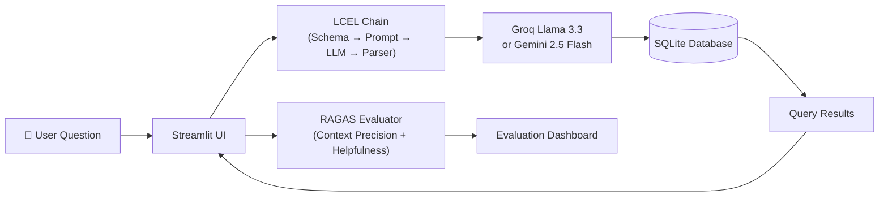

<p align="center">
  
</p>

<p align="center">
  <a href="https://text-to-sql-chatbot-main-qlt4z8jx8aewbafdybguyt.streamlit.app/" target="_blank">
    
  </a>
</p>

<p align="center">
  <a href="#features">Features</a> ·
  <a href="#architecture">Architecture</a> ·
  <a href="#quick-start">Quick Start</a> ·
  <a href="#usage">Usage</a> ·
  <a href="#evaluation">Evaluation</a> ·
  <a href="#project-structure">Structure</a> ·a
  <a href="#comparison">Comparison</a> ·
  <a href="#contributing">Contributing</a>
</p>

<p align="center">
  
  
  
  
  
  
  
  
</p>

---

## Features

- **Natural Language → SQL** — Ask in plain English, get SQL queries + query results
- **LCEL Chain** — LangChain expression language pipeline (schema → prompt → LLM → parser)
- **Multi-LLM Support** — Groq (Llama 3.3 70B) + Google Gemini (2.0/2.5 Flash)
- **RAGAS Evaluation** — Built-in quality scoring (Context Precision, Helpfulness Rubrics)
- **Streamlit UI** — Chat interface with live schema viewer and evaluation dashboard
- **CSV → SQLite Pipeline** — Zero-config database setup from CSV files

## Architecture



| Component | Stack |
|---|---|
| **Frontend** | Streamlit (chat + eval tabs) |
| **Orchestration** | LangChain LCEL (RunnablePassthrough → Prompt → LLM → StrOutputParser) |
| **LLM** | Groq `llama-3.3-70b-versatile`, Gemini `2.0-flash` / `2.5-flash` |
| **Database** | SQLite (auto-seeded from CSVs) |
| **Evaluation** | RAGAS (Context Precision, Rubrics-based Helpfulness) |
| **Embeddings** | `sentence-transformers/all-MiniLM-L6-v2` |

## Quick Start

```bash
git clone https://github.com/kairav7220/Text-to-SQL-Chatbot-main.git
cd Text-to-SQL-Chatbot-main
pip install -r requirements.txt
```

Set your API keys in `.env`:

```env
GROQ_API_KEY="gsk_..."
GOOGLE_API_KEY="AIza..."
```

Run the app:

```bash
streamlit run app.py
```

Ask "What was the budget of Product 12?" in the chat — you get the SQL and the result.

## Usage

### Streamlit App

```bash
streamlit run app.py
```

Two tabs:
- **Chat** — conversational interface, shows SQL + result per message
- **Evaluate** — runs 5 benchmark queries, scores via RAGAS metrics

### Script Mode

```bash
python 1.py   # Gemini LCEL chain (query "Geiss Company line total")
python 2.py   # Groq chain + RAGAS evaluation on 5 questions
```

### CSV → Database

```bash
python create_db.py
```

Auto-loads CSVs from `Data_CSV/` into a local SQLite database.

## When to Use

| Do | Don't |
|---|---|
| Ad-hoc analytics on structured data | Complex multi-database joins |
| Prototyping NL-to-SQL for your domain | Production workloads (no auth, rate-limiting) |
| Learning LangChain patterns | Real-time streaming queries |
| Benchmarking LLM SQL generation accuracy | Sensitive data (API keys in `.env`, no encryption) |

## Comparison

| Feature | This Project | LangChain SQL Agent | SQLAlchemy + Hand-coded |
|---|---|---|---|
| UI | ✅ Streamlit | ❌ CLI only | ❌ |
| RAGAS Evaluation | ✅ Built-in | ❌ | ❌ |
| LCEL Pipeline | ✅ Runnable chain | ✅ | ❌ |
| Multi-LLM | ✅ Groq + Gemini | ✅ | ❌ |
| CSV → DB Seeding | ✅ Auto | ❌ | ❌ |

## Project Structure

```
Text-to-SQL-Chatbot-main/
├── app.py                  # Streamlit app (chat + eval)
├── 1.py                    # Gemini LCEL chain (minimal)
├── 2.py                    # Groq chain + RAGAS script
├── create_db.py            # CSV → SQLite migration
├── Data_CSV/               # Source CSV files (7 tables)
├── data_dump/              # Additional CSV exports
├── requirements.txt        # Python dependencies
├── CONTRIBUTING.md         # Contribution guide
├── llms.txt                # AI assistant context
├── .gitignore
└── LICENSE                 # MIT
```

## Evaluation

Sample RAGAS results (Groq Llama 3.3 70B on 5 benchmark queries):

| Metric | Score |
|---|---|
| Context Precision | 1.0000 |
| Helpfulness (Rubrics) | 3.80 / 5.00 |

## Contributing

See [CONTRIBUTING.md](CONTRIBUTING.md) for guidelines on how to contribute.

## License

MIT © [kairav7220](https://github.com/kairav7220)

---

<p align="center">
  Built with <a href="https://python.langchain.com">LangChain</a> ·
  <a href="https://groq.com">Groq</a> ·
  <a href="https://ai.google.dev/gemini-api">Gemini</a> ·
  <a href="https://docs.ragas.io">RAGAS</a>
</p>
