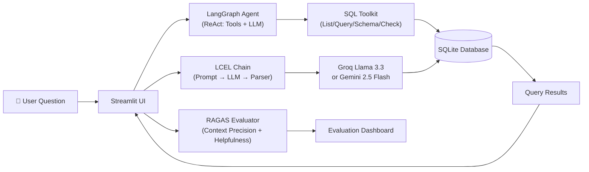

<p align="center">
  
</p>

<p align="center">
  <a href="https://text-to-sql-chatbot-main-qlt4z8jx8aewbafdybguyt.streamlit.app/" target="_blank">
    
  </a>
</p>

<p align="center">
  <a href="#features">Features</a> ·
  <a href="#architecture">Architecture</a> ·
  <a href="#quick-start">Quick Start</a> ·
  <a href="#usage">Usage</a> ·
  <a href="#code-highlights">Code Highlights</a> ·
  <a href="#evaluation">Evaluation</a> ·
  <a href="#project-structure">Structure</a>
</p>

<p align="center">
  
  
  
  
  
  
  
</p>

---

Query a SQL database using natural language. Built with LangChain, LangGraph, Groq LLM, and RAGAS evaluation.

## Architecture



## Quick Start

```bash
git clone https://github.com/kairav7220/Text-to-SQL-Chatbot-main.git
cd Text-to-SQL-Chatbot-main
pip install -r requirements.txt
```

Set your API keys in `.env`:

```env
GROQ_API_KEY="gsk_..."
GOOGLE_API_KEY="AIza..."
```

```bash
streamlit run app.py
```

## Usage

```bash
streamlit run app.py   # Chat + Evaluation UI
python 1.py            # Gemini chain (single query)
python 2.py            # Groq chain + RAGAS on 5 queries
python create_db.py    # Reload CSVs into SQLite
```

## Code Highlights

**Prompt engineering that strips markdown fences** (`app.py:83-91`):
```python
def run_query(question: str):
    raw = sql_chain.invoke({"question": question}).strip()
    if "```" in raw:
        match = re.search(r"```(?:sql)?\s*(.*?)\s*```", raw, re.DOTALL | re.IGNORECASE)
        sql = match.group(1).strip() if match else raw
    else:
        sql = raw
    sql = " ".join(sql.split())
    result = db.run(sql)
    return sql, result
```

**Self-seeding database from CSVs** (`app.py:19-29`):
```python
def ensure_database():
    conn = sqlite3.connect("text_to_sql.db")
    existing = conn.execute("SELECT name FROM sqlite_master WHERE type='table'").fetchall()
    existing_tables = {row[0] for row in existing}
    for csv_file, table_name in CSV_TABLES.items():
        if table_name not in existing_tables and os.path.exists(csv_file):
            df = pd.read_csv(csv_file)
            df.to_sql(table_name, conn, if_exists="replace", index=False)
```

**LangGraph agent with 4 SQL tools** — list tables, inspect schema, query, double-check. Agent reasons over multiple steps before answering.

**RAGAS evaluation built into the UI** — 5 benchmark queries scored on Context Precision (0-1) and Helpfulness Rubrics (1-5) with a single button click.

## Evaluation

| Metric | Score |
|---|---|
| Context Precision | 1.0000 |
| Helpfulness (Rubrics) | 3.80 / 5.00 |

## Project Structure

```
Text-to-SQL-Chatbot-main/
├── app.py                  # Streamlit app (chat + eval)
├── 1.py                    # Gemini LCEL chain
├── 2.py                    # Groq chain + RAGAS script
├── create_db.py            # CSV → SQLite migration
├── Data_CSV/               # Source CSV files (7 tables)
├── data_dump/              # Additional CSV exports
├── requirements.txt        # Python dependencies
├── runtime.txt             # Python 3.11.5
├── .gitignore
└── LICENSE
```

## License

MIT © [kairav7220](https://github.com/kairav7220)

---

<p align="center">
  Built with <a href="https://python.langchain.com">LangChain</a> ·
  <a href="https://langchain-ai.github.io/langgraph">LangGraph</a> ·
  <a href="https://groq.com">Groq</a> ·
  <a href="https://docs.ragas.io">RAGAS</a>
</p>
